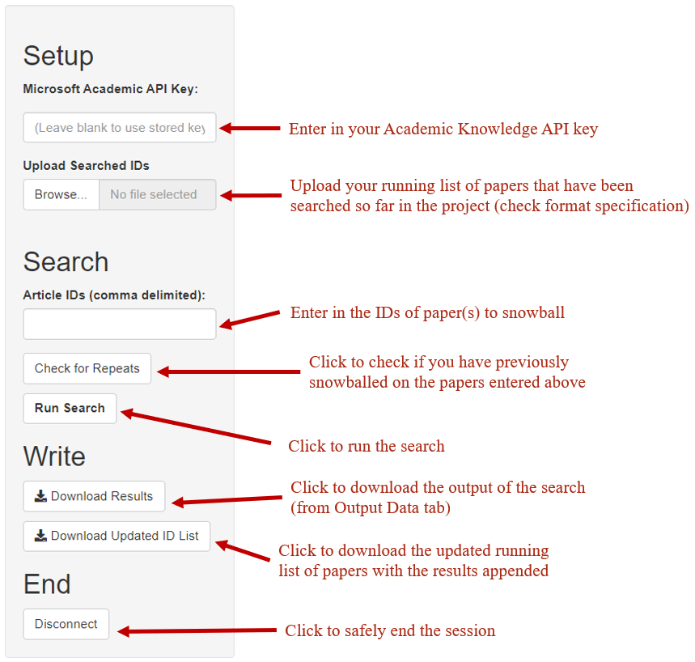
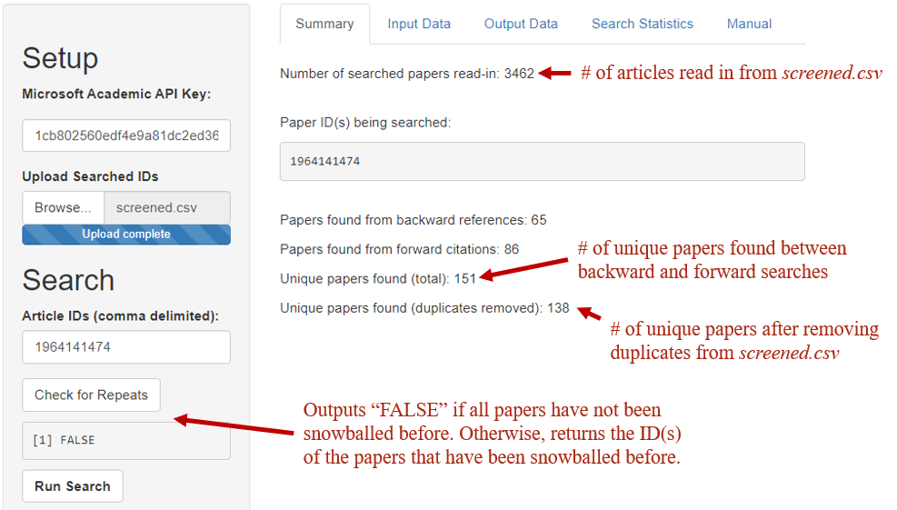
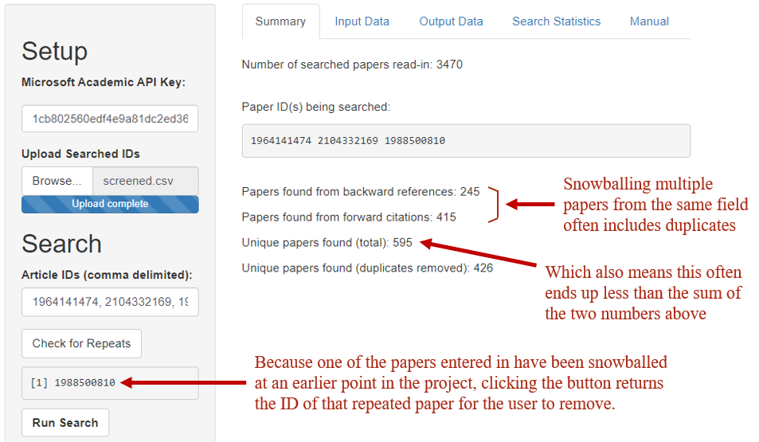
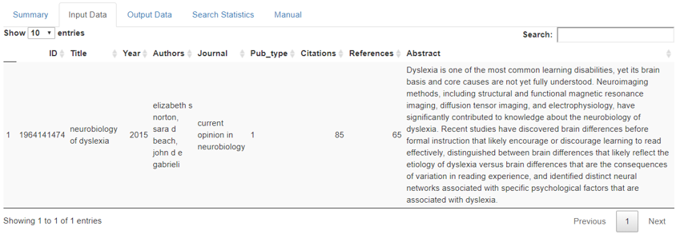
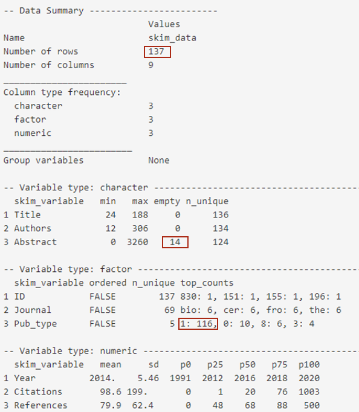

_Legal disclaimer goes here_

# Snowballer Manual
### June Choe (jchoe001@gmail.com)
#### January 2020

---

# Introduction

---

## About

---

**Snowballer** is an app that runs forward (citations) and backward (references) searches for a given list of papers and fetches information about the searched papers using [Microsoft Academic](https://www.microsoft.com/en-us/research/project/academic/).

Papers are searched using the IDs that they are assigned in the database. The ID of a paper can be found by looking up the paper online on the [Microsoft Academic database](https://academic.microsoft.com/home). If the paper exists in the databse, its ID can be found in the page that contains information about the paper after `paper/` in the URL. For example, the paper at the url `https://academic.microsoft.com/paper/2170716495/...` has the ID _2170716495_.

---

## Setup

---

To query the online database, you need Microsoft's Academic Knowledge API key. The API key permits you to 10,000 transactions (papers fetched online) a day. [Sign up for an API key here.](https://msr-apis.portal.azure-api.net/signup) After signing in, you can [find your API key here](https://msr-apis.portal.azure-api.net/) under the KEYS tab.

You also want to prepare a running list of articles that have been searched/screened so far in the project, named `screened.csv`, with 11 fields:

- `Date` : the time that the snowball search was conducted
- `Searched_from` : the paper(s) that were passed in as input for the snowball search
- `ID` : paper's ID
- `Title` : paper's title
- `Year` : year of publication
- `Authors` : list of authors, separated by commas
- `Journal` : journal that the paper was published in
- `Pub_type` : type of publication 
- `Citations` : number of citations
- `References` : number of references
- `Abstract` : paper's abstract

The first two colums: `Date` and `Searched_from` are metadata about the search that Snowballer appends to the output result, but it needs those columns to be initialized in the input file to do that. The rest of the columns are the information that Snowballer returns for each paper it finds from the snowball search.

--- 

## Walkthrough

---

### Sidebar Panel

---

The input fields and action buttons in the sidebar panel are layed out in order from top to bottom.

Descriptions are provided in the image below:

---

### **Summary** Tab

---

Once you type in the paper ID, the **Summary** tab automatically updates with information about citation connections.

Here, a paper with the ID _1964141474_ (Norton et al. 2015) is snowballed.

Here's another example, this time with 3 IDs: _1964141474_, _2104332169_, _1988500810_.

In this example, _1988500810_ has already been snowballed and recorded in the `screened.csv` file that is read in.

---

### **Input/Output** Tab

---

After you click the **Run Search** button, you can proceed to the **Input Data** and the **Output Data** tabs to retrieve information about the papers you passed in and, more importantly, the result of the snowball search.

Below displays the **Input Data** tab after running a snowball search on _1964141474_. This is useful for double checking that the paper ID you ran the search on is indeed the paper you meant to snowball.

The results in the **Output Data** has the same format, except with more papers.

---

### **Search Statistics** Tab

---

After running the search, you can also look at some basic statistics about the search.

The **Search Statistics** tab includes a comprehensive skim summary and visualizes the distribution of years, authors, and journals of the papers returned in the **Output Data** tab.

The graphs are simple, but the skim summary takes a bit to process. You mainly want to focus on the number of observations, the number of missing abstracts, and the number of journal articles (Pub_type == 1), boxed in the image below in that order.

**NOTE**: Sometimes, the number of papers that are searched from the summary tab don't match the number of papers that are returned. That's is the case in this example, where we expected to get 138 papers but ended up with 137. This is a problem with the Microsoft Academic database assigning a paper an ID, but not storing any information about that paper that could be fetched.

---

## The End

---

For now.

Many thanks to LEARN lab, especially Sean, Jinnie, and Prof. Norton for providing suggestions and support.
